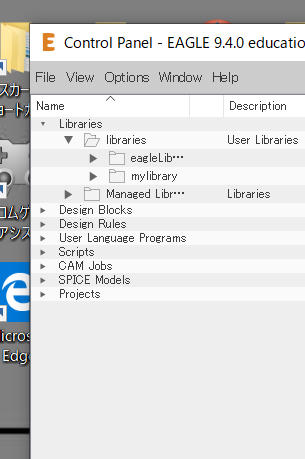
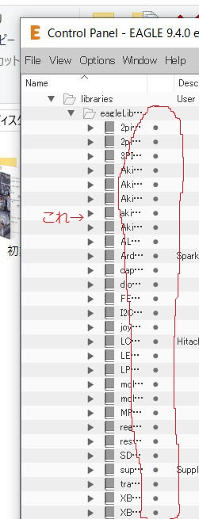
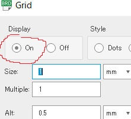
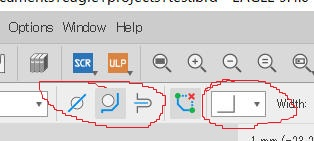
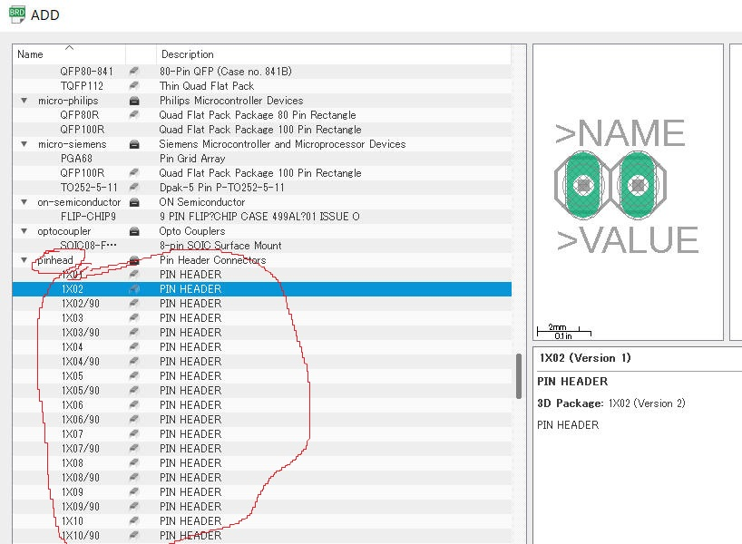

## 編集者から
こちらは、先輩が作成したtxt文章を物理部パソコンから発見し、こちらのサイト向けに書き直したものです。 
忙しい中、このような素晴らしい記事を書いてくださった先輩に、感謝の意を表します。 

## EAGLEについて
使うセンサーとかが決まったら、いよいよ基板を描く作業が始まります。ここが一番時間がかかる部分です。 
物理部ではEAGLEというソフトを使っています。 
このソフトは海外製で英語なのですが、回路図と基板図を同時に作成でき、便利なので使っています。 
その使い方についてはそこそこ詳しく解説しているサイトがあったので、URLを貼っておきます。 
- http://akiracing.com/2017/05/27/eagle_tutorial

というわけで、ここの解説をパk…参考にしつつ、足りないところや自分が使ってみて感じたことなどを書くことにしました。

(編集者より: 現在の物理部ではfusion360が主流?です。)

## アカウントおよびライセンス
EAGLEには無料版と有料版、および学生向けがあります。 
無料版は機能がいくつか制限されており、このままでは150×100mmの基板を設計できません。 
有料版ならできるのですが、やはりお金がかかります…。 
そこで、学生向けのを使うことをお勧めします。学生なら有料版と同じのが3年間無料で使えるのです。 
そのためには学生としてアカウントを登録する必要があります。 
(方法は自身で検索してみてください。) 
あるいは有料版を買っても良いです。とにかく無料版ではできません。

## 一連の流れ
さて、EAGLEを使っての設計の手順というか、流れみたいなのは以下の通りです。

1. 使う部品とその配置レイアウトをだいたい決める
1. +5vとGNDをとりあえずいい感じに配線する
1. モータードライバのモーター側と電源関係を、下基板(以下、下)の穴まで持っていく
1. モータードライバのマイコン側とボールセンサを、上基板(以下、上)と下をつなぐとこまで引っ張る 
そして、上のマイコンとつなげる
1. 他の部品を同様につなげる
1. このあたりで、配線が通せなかったりする箇所が出で来るので、いろいろいじくって何とかする
1. GNDをベタ塗りして、ベタ同士をジャンパでつなげる
1. 手直しして設計完了。基板製作に移る
  

- 基板製作(感光基板の場合)
1. 基板データを専用のフィルムに印刷
1. 以下、暗室で行う
1. 感光基板を袋から取り出す
1. 感光基板の金属面側を上にし、フィルムを重ね、光を決められた時間当てる
1. 基板を現像液に浸す
1. 基板をエッチング液に浸す
1. 基板をスチールウールとかでごしごしする
1. (サビ防止液も塗る)
1. 後は穴あけ→はんだ付けをする

詳しい手順はエッチング液の説明書に書いてあります。 
バットやバケツ、コンクリやお酢などを用意してくださいね。

## アドバイス
(本当はこの後操作方法などをいろいろ説明する予定だったのですが、夏休み中にこれをやる時間が全然なかったので) 
これだけは伝えたほうがいいと思ったものを書き残しておきます。 
後は上記のサイトなどを参考にしてください。

- 最初の画面(コントロールパネル)の*Libraries*のところで、●を緑にしないと部品が読み込めないので、緑にしておく。(写真1、2を参照)

- GridのDisplayをOnにしないと、背景の格子が出ない(写真3)

- BRDで、線を直角に曲げたかったり、穴を迂回させたくないときは、写真4のあたりをいじるとよい

- 部品とかは実はmmじゃなくてinch単位だったりするので、正確にやりたければそっちでやるのもあり
- ピンヘッダは「pin」で検索してでる、こいつ(写真5)を使うとよい 
ジャンパ線に使えたりするので、接続部以外にも使うことになる。

- BRDでICの電源につなげられない時がある。そのときは一度SCHを閉じ、BRDで配線を行えばよい

こんなところでしょうか

アドバイスは必要に応じて追記・修正して問題ありません

## おわりに
僕は果たして良い先輩、良い部長だったのでしょうか?
今でも疑問が残ります。全国も61/64位でしたし。
しかし、後輩がいろいろと修正して、今後はもっと良くなっていくでしょう。
というわけで、最後に一言だけ

**幸運を。去りゆく者より敬礼を。**

部長でした。