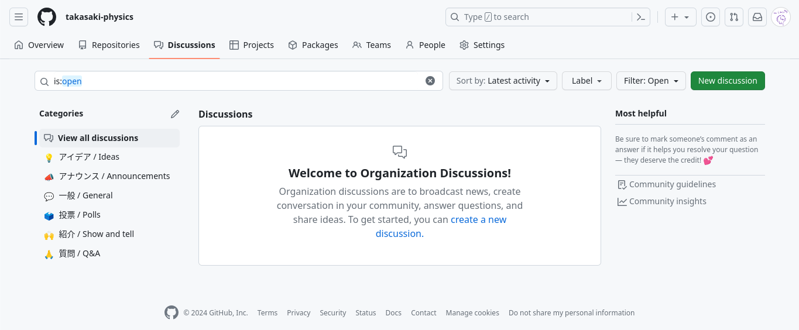

こんにちは。
[mint73](https://github.com/mint73) です。

こちらは、主に物理部の部員や開発者向けの資料となっています。

## GitHub Discussions

物理部の Discussions は[こちら](https://github.com/orgs/takasaki-physics/discussions)!!

GitHub には、 Discussions という機能があります。
一般的にはレポジトリの Discussions がプログラムの新機能に関するアイデア出しやプログラムへの質問などで利用されます。
Organization でも同様の機能が利用可能で、物理部では一般的な会話に利用するつもりです。(まあ、基本的な会話は物理部の Slack でも良いのですが、履歴が残らないので、私的にはこちらを利用したいと考えています。)

物理部以外の人でも、こちらに質問可能なので、ぜひぜひご利用ください。
