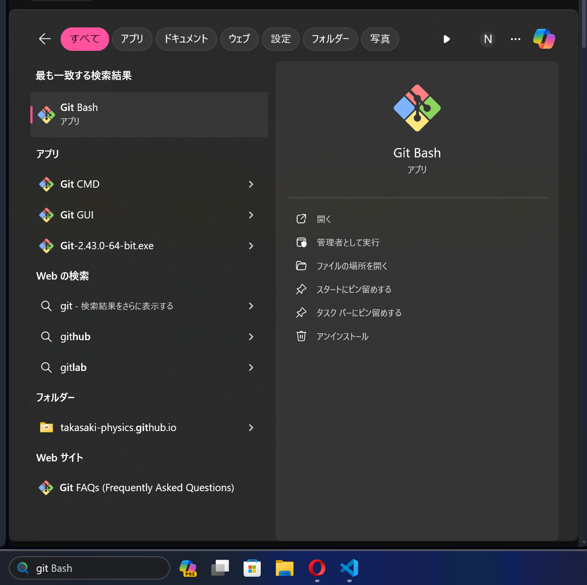

こんにちは。
[mint73](https://github.com/mint73) です。

今回は Git インストール後に必ず必要な設定に関して記述していきます。
(先週金曜日の Git 設定の時に忘れていたやつ。)

## 方法
ユーザー名とメールアドレスの設定をします。

1. Git Bash を起動<br />
初めに Git Bash を起動します。



Windows の場合は上のように起動できます。
VSCode の Git Bash を利用しても構いません。

1. 設定する
Git Bash で以下のコマンドを実行します。
```bash
$ git config --global user.name [ユーザー名]
$ git config --global user.email [メールアドレス]

# 例
$ git config --global user.name "mint73"
$ git config --global user.email example@example.com
```
ユーザー名もメールアドレスも GitHub と同じものがよいでしょう。

1. 確認する
Git Bash で以下のコマンドを実行することで正常に設定できているか確認できます。
```bash
$ git config --global --list
user.name=mint73
user.email=example@example.com
```

以上です。

## 参考
- https://reasonable-code.com/git-init-setting/
