# はじめに
こちらは、先輩が作成したWord文章をこちらのサイト向けに書き直したものです。 
忙しい中、このような素晴らしい記事を書いてくださった先輩に、感謝の意を表します。 

## 環境準備など

### インストールするもの
- Fusion360 (**教育版**)

Autodesk のホームページからアカウントを教育版にしてください。 

- Eagle

Fusion360 に統合された基板設計ソフトです。 
教育版のアカウントがあれば無料でインストールできます。 
入れておくと助かるときがあるので一応入れておいてください。 

### 使うサイト
- [Ultralibration](https://www.ultralibrarian.com/)

回路設計に必要な部品のライブラリの多くが無料で配布されています。 
ここにあれば自分でライブラリを作らずに済むのでとても楽になります。 

- [JLCPCB](https://jlcpcb.com/)

中国の基板製作サービスです。 

## 回路設計を開始する
まずは、<kbd>新規電子デザイン</kbd>で作成します。 
忘れずに名前を付けて保存をしてください。 

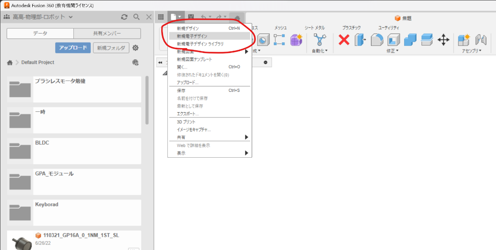

次に、<kbd>新しい回路図</kbd>を押して回路図を作ります。 
もちろん、名前を忘れずに。 
回路図の作り方は、以下の画像に詳しく書き込んでおいたので、そちらを参照してください。 

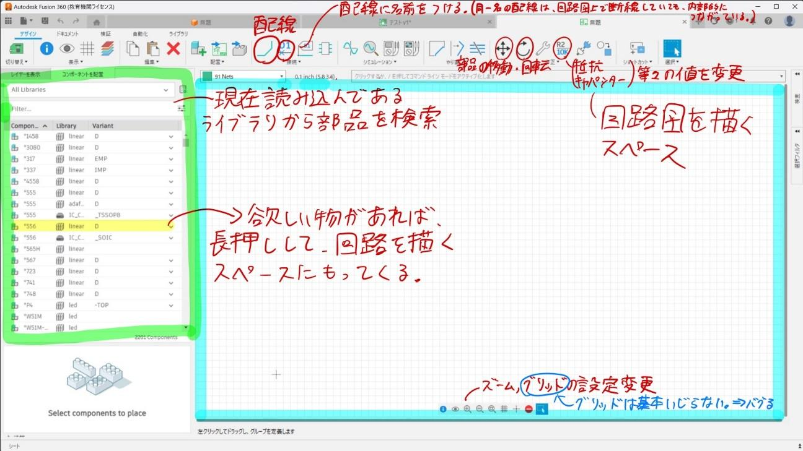

今回はIRセンサを1つ作る基板を例とします。 
IRセンサ **TSSP58038** は残念ながら Ultralibration にないので、 SnapEDA からダウンロードします。 
("(部品名) footprint" と検索すると Ultralibration や SnapEDA 、公式サイト等が出てくると思います。) 

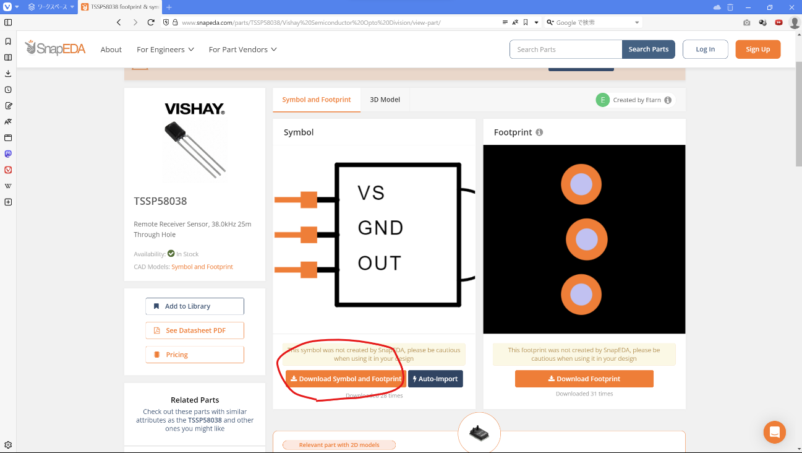

ダウンロードの際は、 **Fusion360** を選択します。 
(Fusion360 がない場合は Eagle を選択してください。互換性があるので問題なく利用できます。今回の SnapEDA もそうです。) 
誤って Altium などの違うソフトを選択しないようにしてください。 

ダウンロードができたら、拡張子が .**lbr** のものを探します。 
これが Autodesk 社の回路のライブラリです。 
ファイル名には部品の名前を付けておくとわかりやすいのでおすすめです。 
これを Fusion360 に読み込みます。 

回路設計の画面を開いて、写真に示すボタンを押してください。 
まず、下の写真のように押します。 

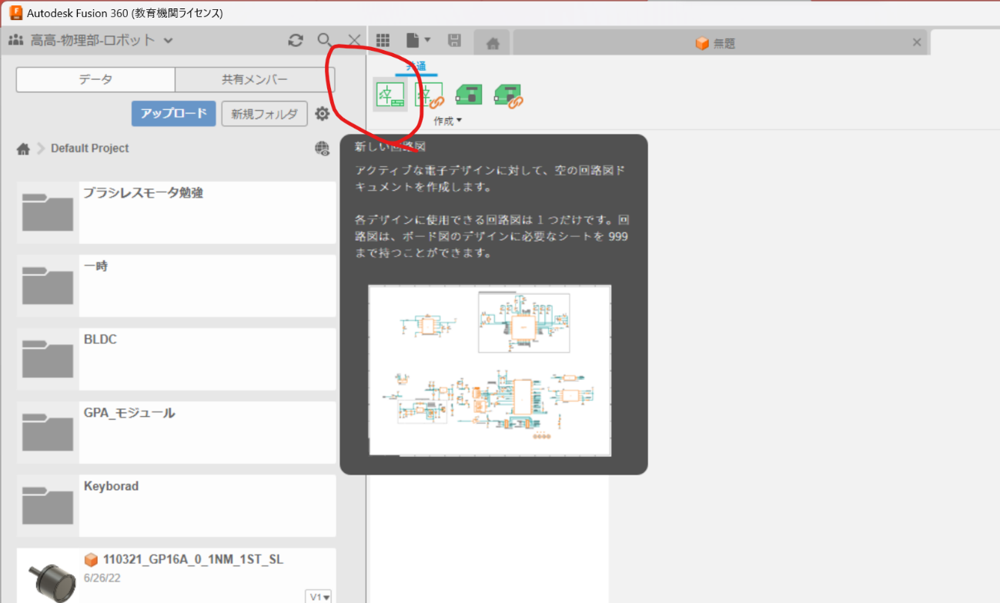
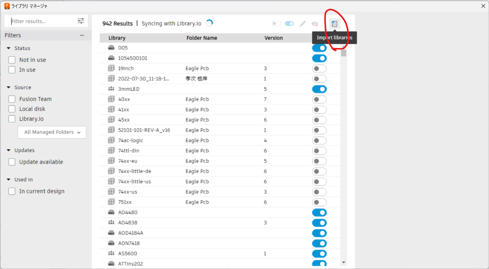

次に、上のところを押します。 
すると、4つ選択肢が出てくるので、 **Import from local disk** を選択してください。 
すると、ファイルを選ぶ画面が出てきます。 
開いたときに出てくるフォルダの中に、別でエクスプローラーを開いてさっきダウンロードしたファイルを移動(コピー)します。 
移動できたらそのファイルを選択して、読み込んでください。
これで完了です。 
あとは、回路設計に戻って検索ボックスに **TSSP** と入れれば出てきます。 

いろいろな部品を使用して配線を行います。 
基本的な部品の検索の仕方はネットに載っていると思うので、調べてみてください。 

以下は、回路が完成した様子となっています。 

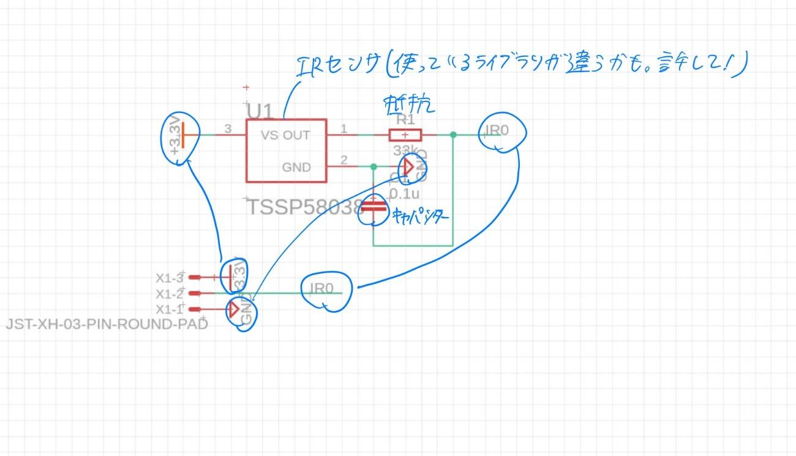

## 基板外形を設計する
まず、いつも通りに設計します。 
作りたい基板の形を平面上に作ってください。 
板の厚みは 1.2mm もしくは 1.6mm が無難です。 

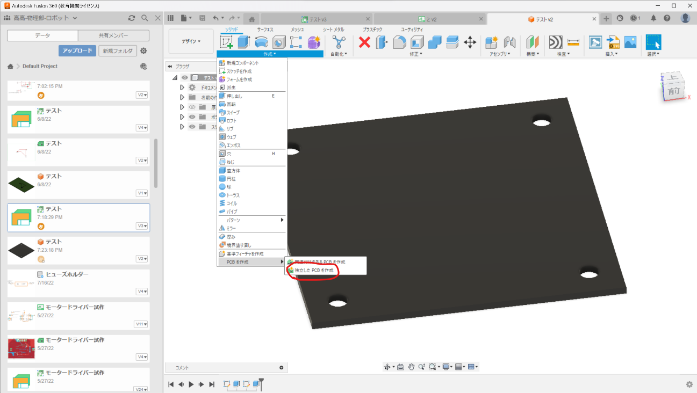

設計する際には、ねじ穴などをあけることを忘れないようにしてくださいね! 
角が直角だと基板にしたときに結構刺さるので丸くしておくといいかもしれません。 
意外と曲線を多用した基板でもちゃんと作ってくれるのでそこは心配しなくて大丈夫です。 
ロボットに合わせた形にしましょう。 
基板の設計ができたら、上の写真のようにボタンを押してください。 
すると、選択する画面が出てくるので、基板の平面の部分をクリックします。 
そして、 <kbd>OK</kbd> を押せば新しいタブに移ります。 
これもまた保存を忘れないようにしてください。 

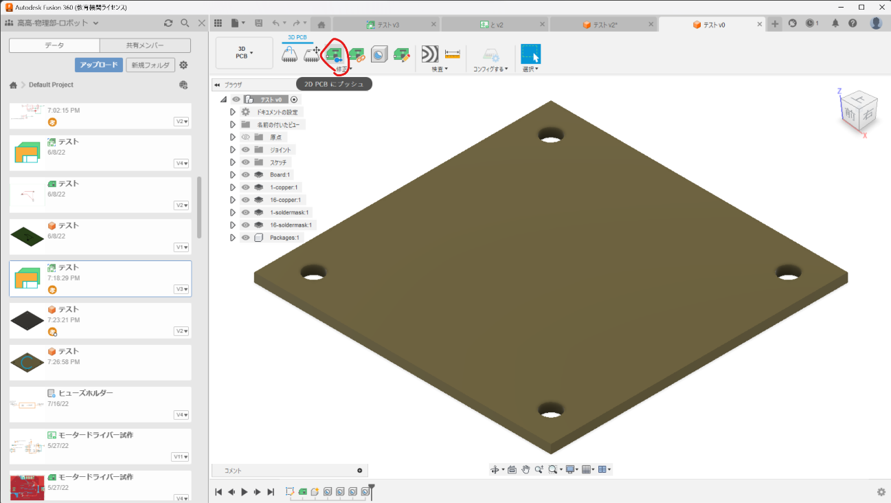

次に、 <kbd>2D PCB にプッシュ</kbd>というボタンを押します。 
すると、平面に基板の外形が映し出された画面に移ります。
必ず保存してくださいね。 
保存したらいったん以下の画面に戻ります。 
戻ったら、 <kbd>PCB ドキュメントへの参照</kbd>を押してください。 

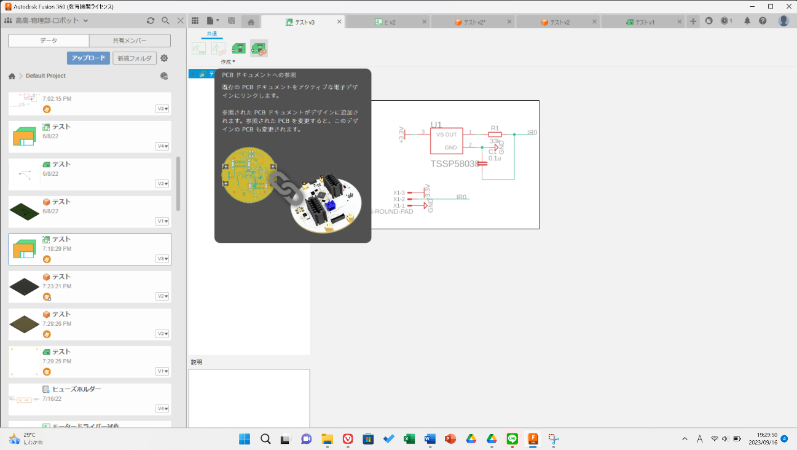

どのファイルをリンクするか聞かれるのでさっき保存したものを選んでください。 
保存してから少し時間が出てこないと選択画面に出てこないので注意してください。 
参照が完了すると、設計した回路図の部品がPCB製作画面に基板外形とともに出てくるので、自分でいい感じに基板上に配置してください。 
部品を移動するときには、部品のところに <kbd>+</kbd> であらわされたマークがあるのでそれをマウスで長押ししながら移動させると動かすことができます。 
部品を細かく動かしたいときには、キーボードの <kbd>Alt</kbd>を押しながら動かすと細かく調整できます。 
また、グリッドの調整をすることで、動かす細かさなども変えることができます。 

部品の配置ができたら配線をします。 

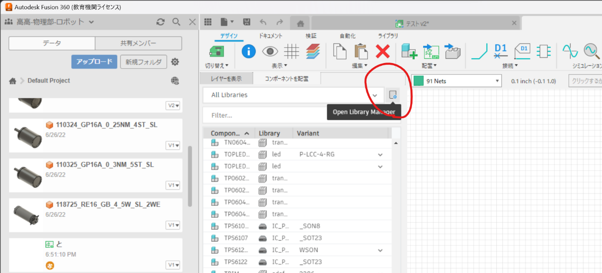

配線は、手動と自動の2種類の方法があります。 
配線が高密度になる時は、自動ではなく手動をお勧めします。 
配線を適当にやると、ノイズの影響で I2C などの通信ができないからです。 
上のツールから<kbd>配線</kbd>もしくは、<kbd>クイックルート</kbd>-<kbd>オートルータ</kbd>を選ぶことで手動、自動配線ができます。 
基本的に基板は表と裏の2層基板なので配線も赤色と青色の2種類があります。 
配線をしている途中にホイールをクリックすると、ビアを通して配線の表と裏を行き来できます。 

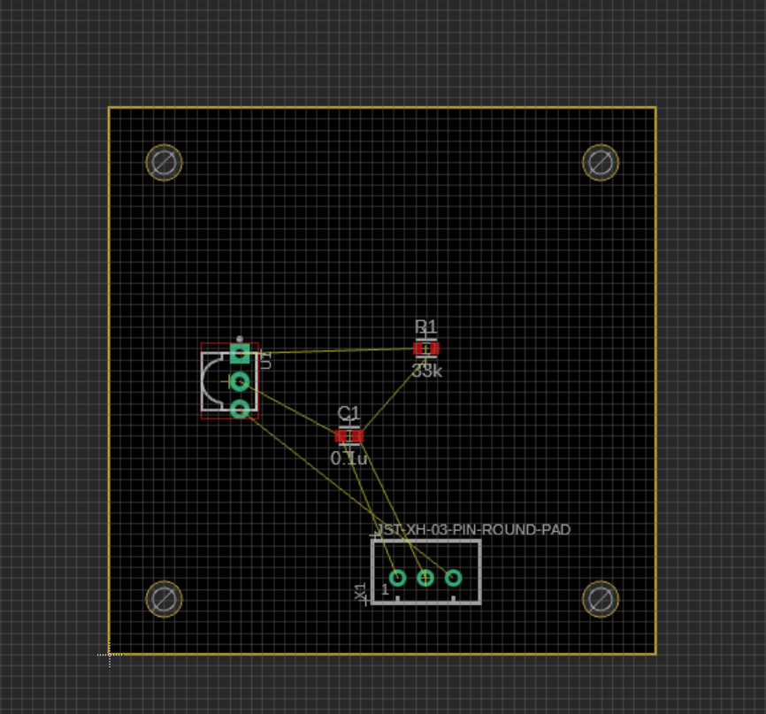 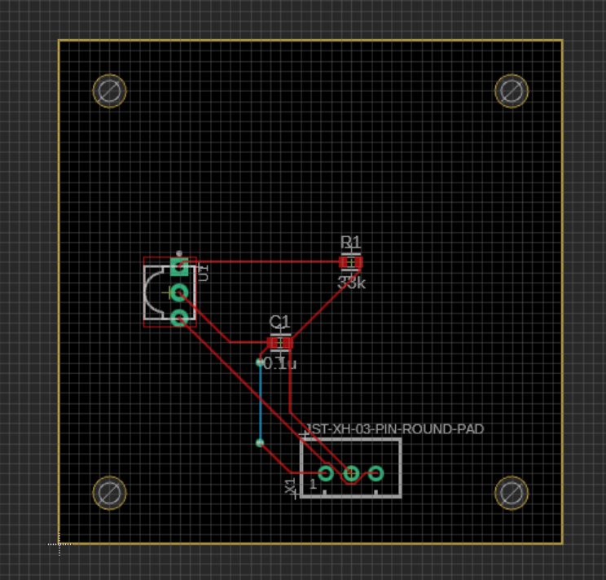

右の写真は配線が終わった様子です。 
(GND ベタを塗ったりエラーチェックなどのやることが残っているが今回は割愛します。) 

## データを出力して注文
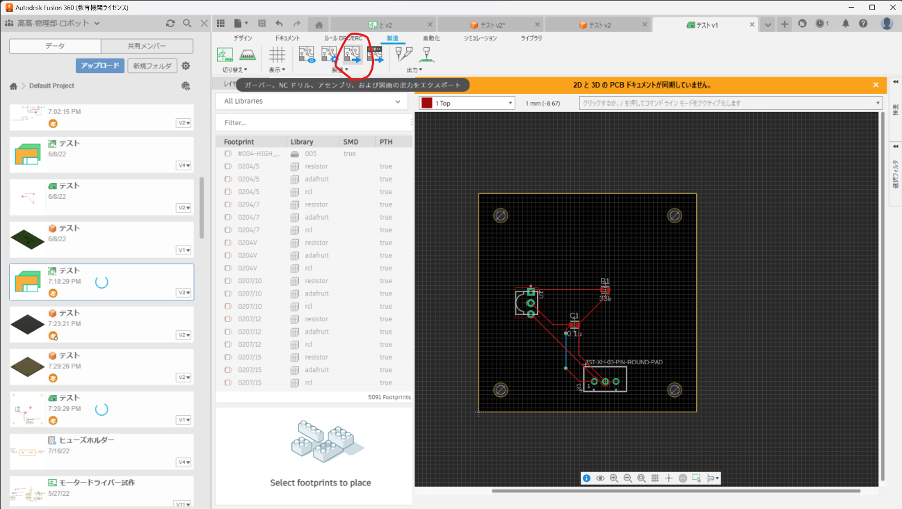

Fusion360 で製作した基板データを出力します。 
上のようにボタンを押して、OKです。 
出力先を求められるので適当に場所を指定すると出力完了です! 
(ファイル名は英語だけにしたほうが注文時にいいかもしれません。) 

あとは、これを JLCPCB に送って注文すればいいです。 
注文の仕方はネットでいろいろ紹介されています。 
配送先については、 DHL が早くて安心できます。 