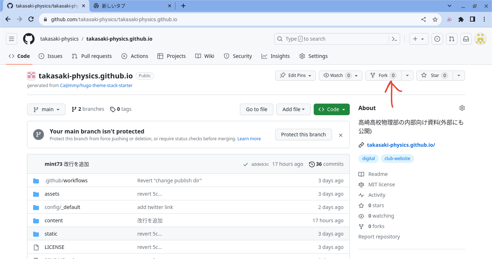
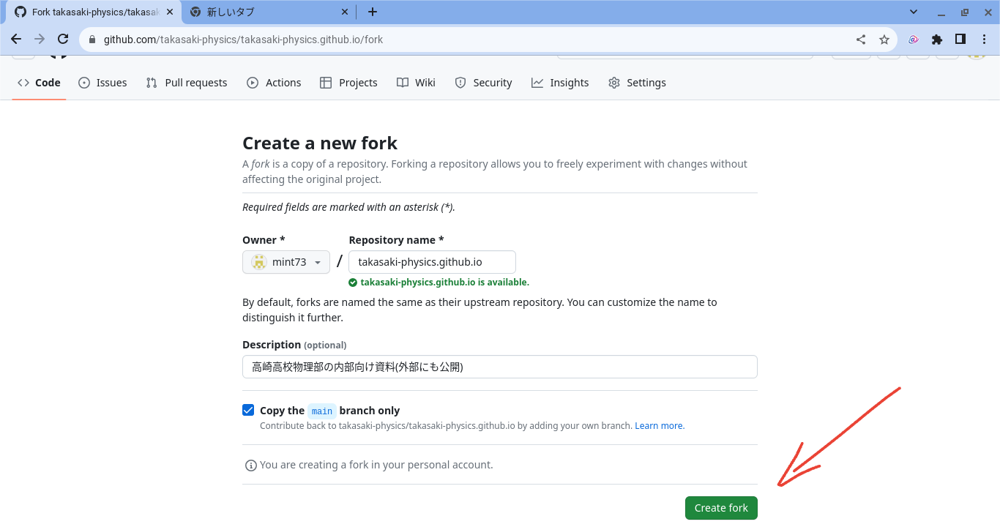
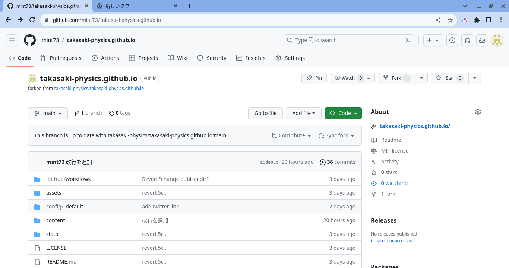
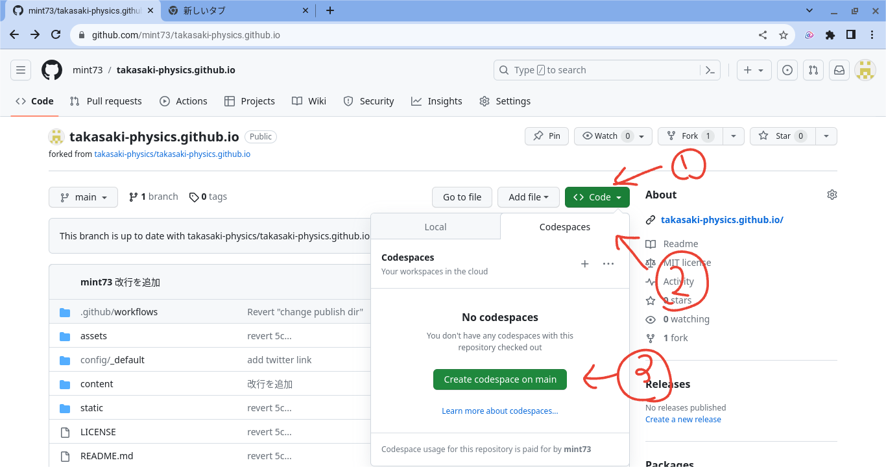
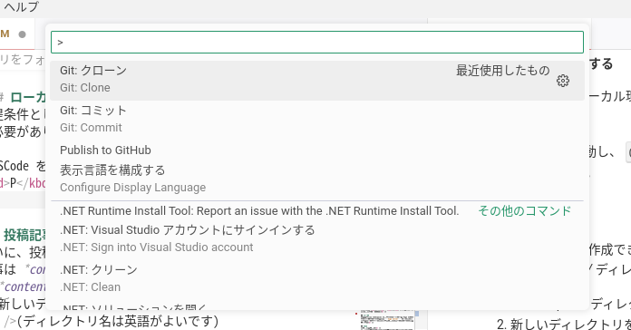
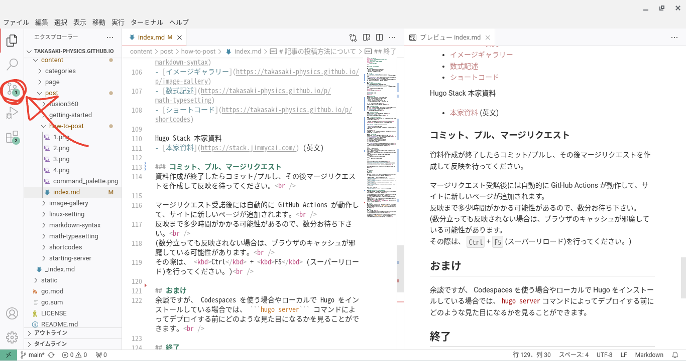
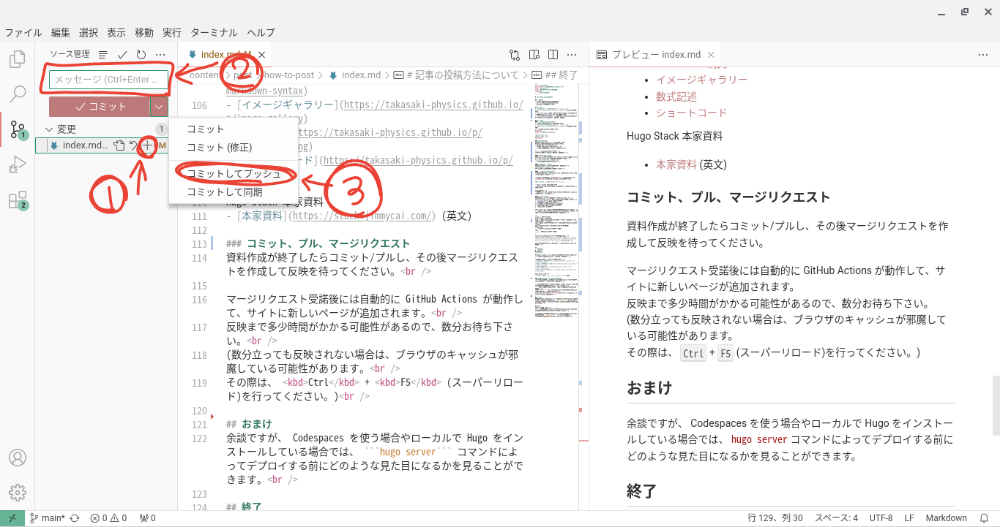

# 記事の投稿方法について

## 前提条件
- GitHub アカウントを保持している
- Git の使い方がなんとなくわかる
- Markdown の書き方がわかる

## TL; DR
1. [本サイトのレポジトリ](https://github.com/takasaki-physics/takasaki-physics.github.io)をフォークします。
1. *content/post/* ディレクトリ内に適当な名前のファイルを配置し、その中に *index.md* を作成します。
1. 記事の内容を Markdown 形式で記述します。(このとき、ページタイトルなどの情報を追加してください。)

## 投稿方法
### レポジトリをフォークする
1. GitHub アカウントにログインします。
1. [GitHub-高崎高校物理部](https://github.com/takasaki-physics/takasaki-physics.github.io)にアクセスします。
1. レポジトリをフォークします。
<details>
<summary>参考画像</summary>



</details>

### VSCodeの起動
ここからは、 VSCode を使って作業します。<br />
VSCode の起動には3つの方法があります。<br />
自分のお好きなものを選択してください。<br />
(ちなみに私はローカルで作業しています。)<br />

- github.dev (ブラウザ)を使う
- GitHub Codespaces (クラウド)を使う
- ローカルにインストールした VSCode を使う

それぞれの方法を解説します。<br />

#### github.dev の起動
こちらはレポジトリを開いた状態(下の画像の状態)でキーボードの <kbd>.</kbd> を押すことで起動できます。<br />

たまに起動できないです。(謎)<br />

#### Codespaces の起動
起動方法は下の画像を参考にしてください。<br />

高機能ですが起動に時間がかかります…<br />

#### ローカル環境で作業する
前提条件として、ローカル環境に Git がインストールされている必要があります。<br />

- VSCode を起動し、 <kbd>Ctrl</kbd> + <kbd>Shift</kbd> + <kbd>P</kbd> を押してコマンドパレットを開きます。



- **Git Clone** と入力します。
- GitHub から先程フォークした当サイトのレポジトリをクローンします。

以上です。<br />
もしかしたら Git の拡張機能や GitHub との連携の設定などが必要かもしれません。<br />

### 投稿記事を作成
ついに、投稿記事が作成できるようになりました!<br />
記事は *content/post/* ディレクトリ内に作成します。<br />
1. *content/post/* ディレクトリを開く
1. 新しいディレクトリを作成する
<br />(ディレクトリ名は英語がよいです)
1. 新規作成したディレクトリに移動する
1. *index.md* を作成する

この *index.md* 内に記事を書いていくこととなります。<br />
ただし、ページ上部に以下の記入をする必要があります。<br />
(日本語の部分は各自書き換えてください。)<br />
```
---
title: タイトルを記入
description: 説明を記入
slug: タイトルを英語で記入(記号は"-"以外基本的に禁止)(これはURLにつかわれます。)
img: 同ディレクトリ内に存在する画層ファイル名を記入(なくてもいい)
date: 日付を記入(例: 2023-09-21 00:00:00+0000)
categories:
    - カテゴリーを記入(なくてもいい)
tags:
    - タグを記入(なくてもいい)
---
```
他の記事の記述方法を真似すると良いです。<br />
(*[content/post/markdown-syntax/index.md](https://github.com/mint73/takasaki-physics.github.io/blob/main/content/post/markdown-syntax/index.md?plain=1)* など)<br />

この記述のあとに通常の Markdown 形式で記述を進めてください。<br />

例:
```markdown
# タイトル
内容を記入
```
Markdown 記法や画像の使い方などに関しては他の記事でまとめられているので、そちらを参照してください。<br />

現時点で作成されたこちらのサイト内の資料
- [Markdown 構文](https://takasaki-physics.github.io/p/markdown-syntax)
- [イメージギャラリー](https://takasaki-physics.github.io/p/image-gallery)
- [数式記述](https://takasaki-physics.github.io/p/math-typesetting)
- [ショートコード](https://takasaki-physics.github.io/p/shortcodes)

Hugo Stack 本家資料
- [本家資料](https://stack.jimmycai.com/) (英文)

### コミット、プッシュ
資料の作成が終わり次第、コミットとプッシュを行います。<br />
1. 作成または更新した資料をステージします。(写真通り **+** を押すだけでOKです。)
1. メッセージを追加します。(無いとエラーになるので**資料追加**とかで良いので適当に入力してください。)
1. コミットしてプッシュをクリックします。
<br />
<br />

### マージリクエストを送る
コミットとプッシュが終わったら、 GitHub 側でマージリクエストを作成し、反映を待ってください。<br />
(部長か誰かがマージを承認してくれると思います。)<br />

マージリクエスト受諾後には自動的に GitHub Actions が動作して、サイトに新しいページが追加されます。<br />
反映まで多少時間がかかる可能性があるので、数分お待ち下さい。<br />
(数分立っても反映されない場合は、ブラウザのキャッシュが邪魔している可能性があります。<br />
その際は、 <kbd>Ctrl</kbd> + <kbd>F5</kbd> (スーパーリロード)を行ってください。)<br />

## おまけ
余談ですが、 Codespaces を使う場合やローカルで Hugo をインストールしている場合では、 ```hugo server``` コマンドによってデプロイする前にどのような見た目になるかを見ることができます。<br />

## 終了
お疲れ様でした。<br />
初期設定は面倒ですが、2回目以降はフォークなどの作業が不要なので、比較的更新は楽になると思います。<br />

マージや、 ```hugo server``` コマンドに関しては、後日詳しい内容や方法を追記するかも知れません。<br />