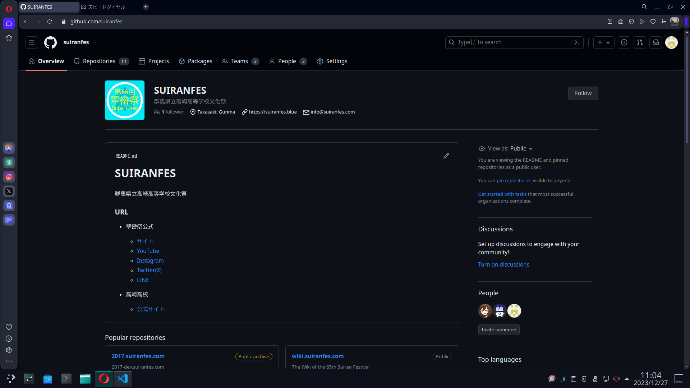

こんにちは。[mint73](https://github.com/mint73)です。

## 本題
[SUIRANFES](https://github.com/suiranfes)に参加させてもらうことになりました。

Thanks: [aqz](https://github.com/tamaina)様 
ありがとうございます!!

## 経緯
(興味がある人だけ読んでください。)

1. [物理部の部長](https://github.com/nAgI314)が、今年(2023年)の模擬店班で会計で利用する電卓のソフトウェアを作成する。
1. 物理部のほうでソフトウェアの共同開発をしていたので、その流れで自分が部長が作ったソフトウェアのUIなどの調整をした。
1. そもそも部長が2023年に作ろうとしていたのが会計での合計金額をサーバーに保管するものだとわかった。 
→今の電卓プログラムをベースにするとUIもプログラムもかなり改善しないといけないし、どうせなら作り直さない??
1. 新型の会計システムを開発することに。
1. 様々な話し合いによって以下の仕様で開発を開始した。
1. また、元々は模擬店班のみが使うアプリケーションだったが、自分の交渉により食堂喫茶店班も採用。今後はグッズ課の勧誘を予定している。

## 仕様
- アプリケーションはセキュリティー的な観点でユーザー側と店側の2つを作成。(詳しくは後述) 
(ちなみに現時点でユーザー側はほとんど完成している。)

- ユーザー側
	- 技術: Blazor wasm
	- 公開: Webベース 
	(一応PWA対応)
	- QRコード生成側
	- 静的サイト
	- アクセス権限: 誰でも利用可能

- 店側
	- 技術: Flutter
	- DB: Firebase 
	(来年からは物理部に独自サーバーが建つので、それでもいいかもしれませんが、他校がこのシステムを使う可能性もあるので、汎用性は残しておきます。)
	- QRコード読み込み側
	- 動的サイト(DBを使ったりするので)
	- アクセス権限: パスワード必要(店員&開発者のみ利用可能)

- セキュリティー
セキュリティーに巻しては

## ロードマップ
開発以外の交渉なども含んでいます。

#### 現在
- ~~ユーザー側アプリケーションの作成~~(ほぼ完成)
- ユーザー側アプリケーションのバグ修正や使い方の説明資料の用意
- 店側のアプリケーションの作成
- ~~模擬店班と仕様の確認~~(特に問題無し)

#### 将来
- ユーザー側アプリケーションのQRコードをパンフレットやサイトに載せてもらう 
実行委員長には伝えてあるが、そもそもパンフレットやサイトの作成の段階に至っていないため、自分ができることは得にない。
- Web課からサブドメインの`shop.suiranfes.blue`を利用させてもらえないかの交渉 
Web課のチーフが誰かわからん 
できるならCI/CDも準備したい。
- 教師に利用許諾をもらう 
店側のアプリケーションが全くできていなくて口頭での説明が難しいため、それがある程度完成したころに相談する。 
まあ、長い期間かけて作ってきたものだし断られる可能性は低いとは思う。 
(セキュリティーに関しても細心の注意を払っているし。) 
翠巒祭担当の教師を想像していたが、校長先生の可能性もある… 
([Web課のサイト公開に関する資料](https://github.com/suiranfes/note.suiranfes.com/blob/pages/002_todos.md#5-webサイトの作成)ではWeb課は校長許可をとっていると明記されているので)
- グッズ課に売り込み 
模擬店と食堂喫茶がこのシステムを採用すると決定しているので、グッズ課も採用してくれると客側が楽になる。 
あとこのシステムを採用すると購入の時間を短く済ませられる(=購入の待ち時間が減る)と思うので。(まあ、模擬店以外はあんまり列できてなかった気がするけど。)
- ユーザーテスト 
各班課の店員が店側のアプリケーションを使う練習と、客側のアプリケーションの使い方を説明できるか、またアプリケーション自体に不備や改善点がないかを調査するための小規模のデモンストレーションを実施予定。 
上記のことがほとんど終わった最終段階にて行う予定。(2024年4月中期とか)
- 引き継ぎ 
来年3年生なので、引き継ぎの資料を作る暇があるかどうかわかりませんが、できれば残します。 
もし資料がなかったら、コードから何とか読み取ってください。(ゴリ押し)

## 関係班課
開発
- 部長(模擬店班)
- 自分(食堂喫茶店班)

使用
- 模擬店班
- 食堂喫茶店班
- グッズ課(勧誘予定)

許諾 / 広報関係
- 翠巒祭実行委員会(本部)
- Web課(ドメイン関係で協力要請予定)
- 広報課?

## 個人的に思うこと
この開発は、交渉とかユーザーが利用しやすいか考えるなどのコーディング以外の要素がかなり重なっていて楽しいです。
多くの人が関係しているアプリケーションということで、文化祭にふさわしいものになったのではないでしょうか?
