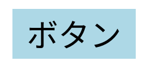
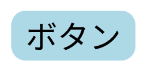
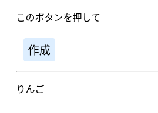
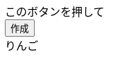
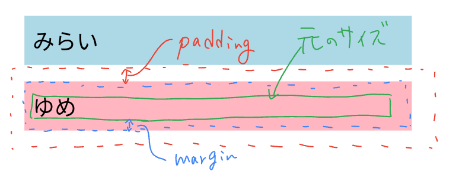
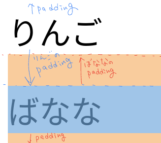
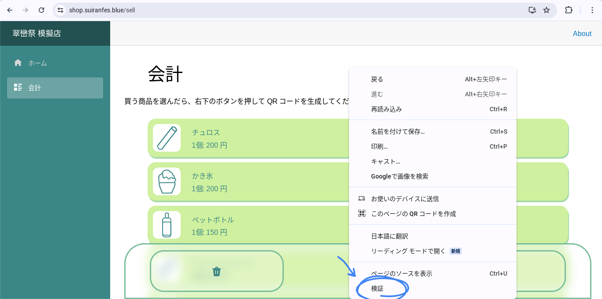
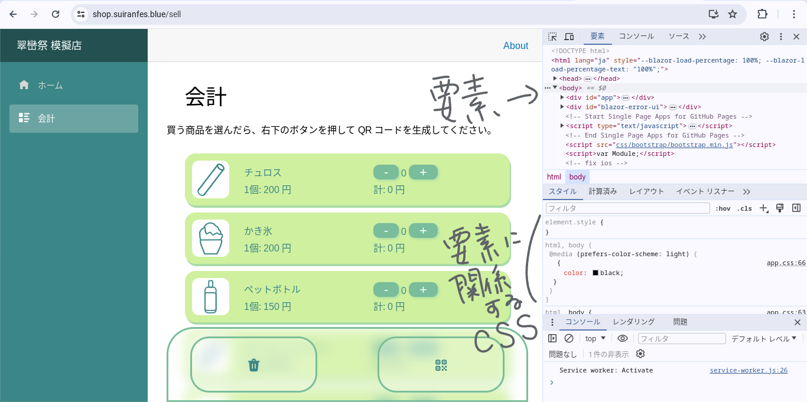
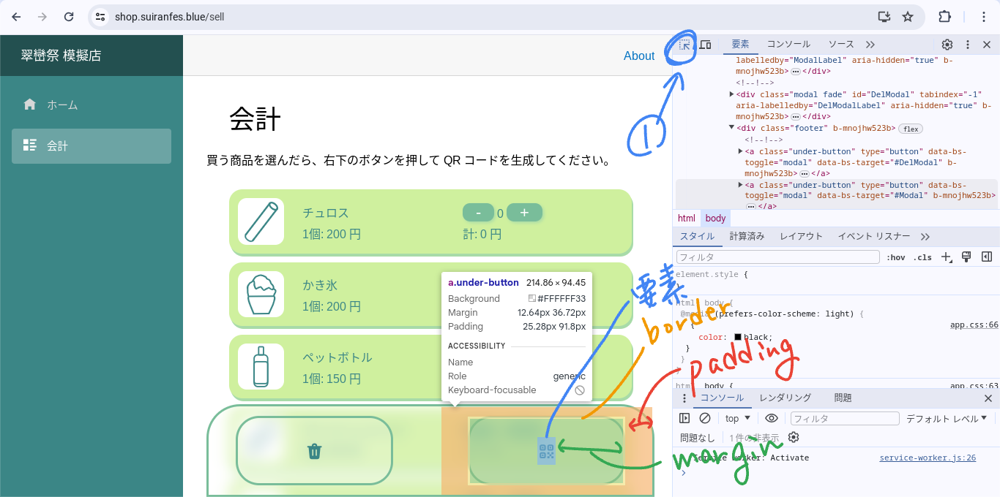

## 目的
角丸の使い方と利用しやすい UI について記載します。

## 角丸
角丸とは、名前の通り角を丸くすることです。

角を丸くすることで、より自然物のようなデザインに仕上げることができます。

ボタンは、通常以下のようなデザインとなります。



(画像は `border-width: 0;` と `background-color: lightblue;` の微調整を加えています)

```.html
<button>ボタン</button>
```

これに、角丸を適応してみましょう。



```.css
button {
  border-radius: 6px;
}
```

これだけで、柔らかいデザインになったのがわかると思います。

## 空白
まずは以下の2つの画像を御覧ください。




どちらのほうが見やすく、使いやすいでしょうか。

ほとんどの人は左を選択すると思います。

文字が詰まっていると、どこを読めばいいのかがわかりにくくなると思います。
また、空白の少ないボタンは、タップの範囲が狭くなるため、パソコンでのクリックも、携帯でのタップ操作も難しくなります。

ここで、適度な空白を設けることによって視認性を向上し、操作のしやすいデザインに仕上げることができます。

### Padding と Margin
空白の設け方は主に2種類あり、`Margin` と `Padding` になります。



それぞれ、`Margin` は内側の空白、`Padding` は外側の空白となります。

といってもよくわからないので、詳しく説明します。

`Margin` は背景を含めた部分の空白となります。
それに対し、`Padding` は背景を含まない部分の空白となっています。



`Padding` は別の要素と重複します。

### 指定
`Margin` と `Padding` は通常

```.css
要素 {
  margin: 12px;
}
```

のように指定します。

しかし、縦と横で異なる値を指定する場合は `縦 横` で指定できます。
つまり、

```.css
要素 {
  margin: 12px 18px;
}
```

と指定することで、縦方向に12px、横方向に18px の `Margin` または `Padding` を指定できます。

更に、上下左右で異なる指定をする場合は `上 右 下 左` の順番にします。

## おまけ
開発者ツールを利用すると便利に開発ができます。

1. Web ページを開き、右クリックをします。
1. "検証"を選択します。  

1. HTML やそれに関係する CSS を見ることができます。一時的に CSS を変更し、見た目を変更することも可能です。(一時的なので、ここでの変更は保存されません。ロードしたら消えます)

1. ツールの右上のボタンを押し、要素の上にカーソルを乗せると、`Margin` や `Padding` などの情報が出ます。  


## まとめ
角丸と空白を使いこなし、美しいデザインを目指しましょう。
