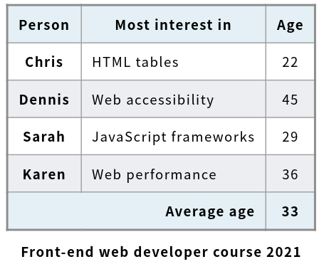
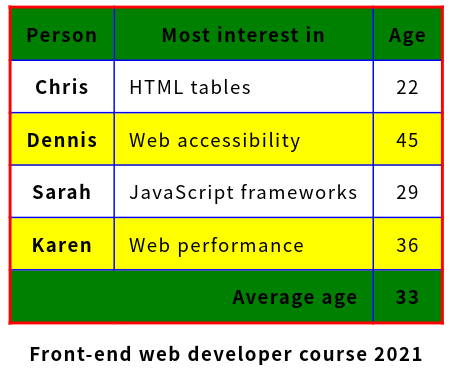
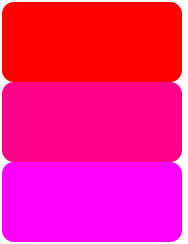
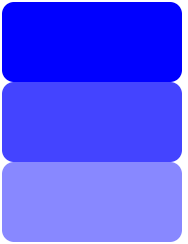
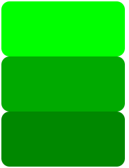
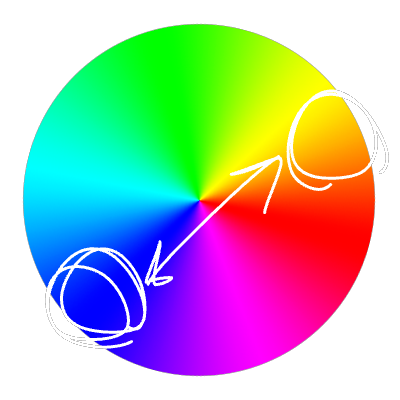
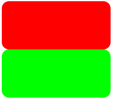
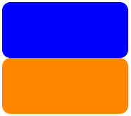
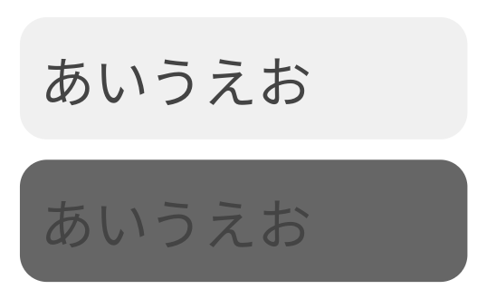

## 目的
デザインにおける色の利用方法について解説します。

この資料は CSS とは関係なく、開発者に知ってもらいたいデザインに関する知識を乗せているので、ぜひ読んでみてください。

## TL;DR;
似た色を使うのがいいです。

[Color | Material UI](https://mui.com/material-ui/customization/color/#color-palette) みたいな

## 色彩学
### 色の重要さ
> いろいろあるよね〜
>
> ([@ssadokafy](https://github.com/ssadokafy) / [部長](https://github.com/nAgI314))

色は、デザインにとって一番重要と言っても過言ではない要素です。

以下の2つの画像を御覧ください。

(https://developer.mozilla.org/ja/docs/Web/HTML/Element/table を参考にして作成)

どちらも同じ UI ですが、配色によってこれほどにも印象が変わります。

色彩という要素を抑えることで、アプリケーションのデザインで他のグループよりも1手先を行くことができます!

### 色彩を構成する3つの要素

(出典: [Wikipedia](https://ja.wikipedia.org/wiki/色相#/media/ファイル:HLSColorSpace.png))

以下の3つの要素を合わせることで、すべての色を作ることが可能です。
(色の考え方は多くありますが、今回は標準的な HSV 色空間に関して解説します)

#### 色相
色相 (*Hue*) とは、青、赤などのベースとなる色です。
色相環の円周上という表現がわかりやすいと思います。

`#ff0000` `#ff0088` `#ff00ff`

#### 彩度
彩度 (*Saturation*/*Chroma*) とは、ベースの色の濃さです。
色相が青とすると、彩度が高いときは青に近く、彩度が低いと白に近くなります。

`#0000ff` `#4444ff` `#8888ff`

#### 明度
明度 (*Value*/*Brightness*) とは、色の明るさです。
明度が高いときはベースの色や白に近く、明度が低いときは黒に近くなります。

`#00ff00` `#008800` `#008800`

### 配色で気をつけるところ
#### 色を多くしすぎない
色を多くすると、どうしてもごちゃごちゃしているように見えてしまいます。

メインで利用する色は4~5色にする、というように決めておくとよいでしょう。

#### 補色

補色は、色相が逆の色の組み合わせです。

赤の背景に緑の文字など、補色の組み合わせは見づらいので、使わないのが無難でしょう。

#### コントラスト比
この画像を御覧ください。

どちらの文字が読みやすいでしょうか。

もちろん、上ですよね。

これは、コントラスト比という要素に関わります。
そのまま明るさの比なのですが、このコントラスト比が大きいほど文字が読みやすいため、これを意識することは重要です。

(人間 (特に色覚異常の人) は色相の違いよりも明度の違いの方が知覚しやすいといわれています)

開発者ツールで確認するのが良いでしょう。

#### 類似色
基本的に、色は類似色で固めるのが無難です。

青紫、青、水色のように、色相を少しずつ変えるパターンと、濃い青、薄い青、白のように、彩度を少しずつ変えるパターンがあります。前者では、水色や黄色などの薄めの色と、青紫のような濃い色を用意し、対比しやすいように準備するのが良いかと思います。

### 色系のツール
便利ツールとして、以下のものがあげられます。

- [Adobe Color](https://color.adobe.com)
- [Color Hunt](https://colorhunt.co/)

## おまけ
おまけです。読まないほうがいいです。

### 赤紫は存在しない
[赤紫とかいう「ない色」 | YouTube](https://www.youtube.com/watch?v=PYE09lfwSys)

面白いので、ぜひ見てみてください。(私は動画の作者ではないです)

### 色覚異常
色覚異常 (色覚多様性) は、人間の錐体 (色の感覚細胞) が欠けている場合に起こる症状です。

ほとんどの人は赤、緑、青の3つの錐体が存在し、可視光の色を検知することができます。
しかし、赤の錐体と緑の錐体は進化する前は元々同じ錐体だったため、稀に赤の錐体または緑の錐体が存在しない人が居ます。
これを2色彩 (正常に見える色と、グレーまたは別の色として見える色がある) と定義しています。
(ごく稀に赤の錐体と緑の錐体が存在するのに青の錐体がない人も居ますが、極めて少数です。ほとんどの青の錐体がない人は赤の錐体も、緑の錐体もない1色彩 (モノクロに見える) となります)

また、錐体がまったくないわけではないけど、少ないということもあり、色弱または軽度の色覚異常として考慮されています。

色覚異常は男性が多く、1型2色彩 (赤の錐体がない) や2型2色彩 (緑の錐体がない) が特に多いです。
この場合、赤色の文字などは黒またはグレーの文字のように見えるため、区別が難しくなっています。

高度なアプリケーションを開発する場合は、このあたりを考慮にいれると多くの人に使いやすいアプリケーションにできます。

(Web ページを右クリック -> "検証" -> 右上の `︙` -> その他のツール -> レンダリング -> 色覚異常をエミュレート を利用してください。)

ちなみに、3型2色彩 (青の錐体がない) では、青色が青緑のように見えます。
青の錐体がないのに、青が見えるというのは奇妙ですが、これは錐体の検知の仕組み的にこの様になっているようです。

[色 | Wikipedia](https://ja.wikipedia.org/wiki/色#三種の錐体細胞と三原色) とかが参考になるかもしれません。

[ICC](https://www.color.org/index.xalter) は国際的な色彩学の組織です。英文ですが、詳しく知りたかったらこの組織の文章を読んでみるのも良いでしょう。

### L\*c\*h 色空間
色空間に関しては、HSV 色空間は絶対的な (コンピュータ的な) 指定は得意なのですが、人間による知覚的な色空間はあまり得意ではありません。
ここで、知覚的な (人間的な) 色の指定を行うことができる L\*c\*h 色空間の考え方も面白いので、ぜひ調べてもらえたらと思えます。

[OK L\*C\*H を使おう | Qiita](https://qiita.com/soi/items/9439ba59cef99b1a1ea5) この文章は参考になると思います。

### ISO 3864-4
> ISO3864では、標識は、言葉の壁を克服するためにグラフィカルな物とすることと規定している。
>
> ([ISO 3864 | Wikipedia](https://ja.wikipedia.org/wiki/ISO_3864) より引用)

標識の色彩に関する国際規格ですが、警告色などの参考になるかと思います。

一般的な UI フレームワークではこれよりも薄い色を利用されることが多いと感じます。

例:

- [Material UI (MUI)](https://mui.com/material-ui/customization/palette/#values)
- [Fluent](https://fluent2.microsoft.design/color#semantic-colors)
- [Bootstrap](https://getbootstrap.jp/docs/5.3/utilities/colors/#カラー)
