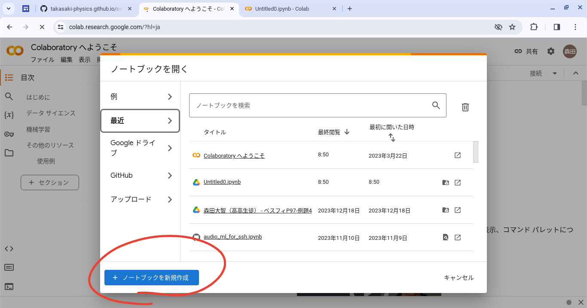
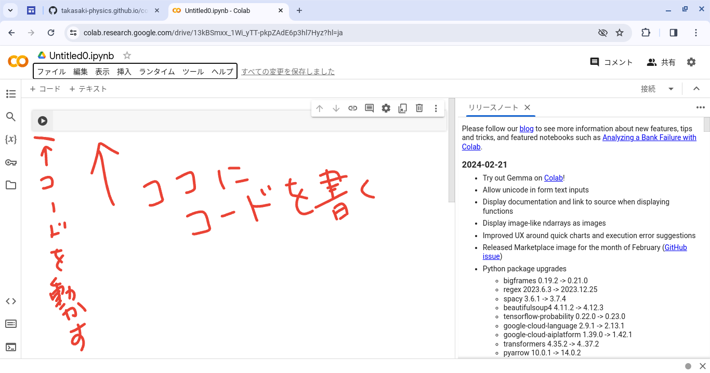
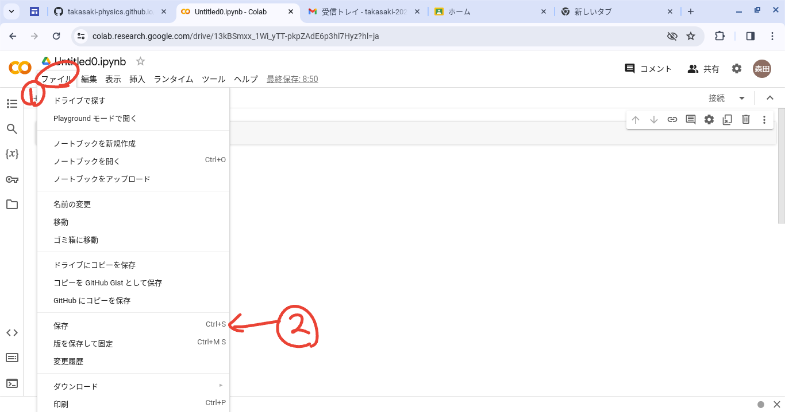

## 目的
Python の環境構築を解説します。
今回は、準備が容易な Google Colaboratory を利用します。

## 環境構築
### 場所

初めに、 https://colab.research.google.com にアクセスします。
(よく使うので、ブックマークで保存すると便利だと思います。)

Google アカウントでログインします。

### 開始
ノートブック(作業ファイル)を作成します。

これで下のように、コードを書くことができます。
コードの左のボタンで動作できます。

### 作業の保存
下の図のように行うことで、セーブできます。

または、 <kbd>Ctrl</kbd> + <kbd>S</kbd> で保存できます。
