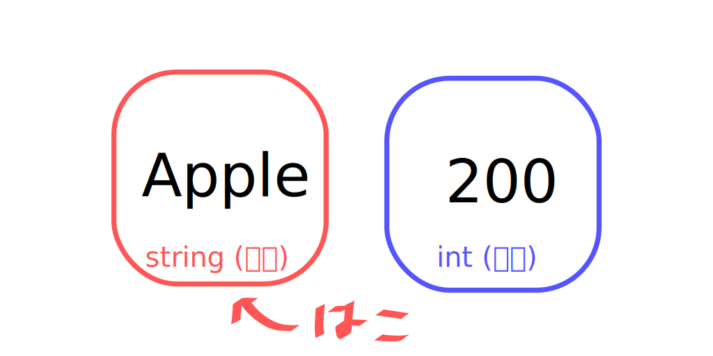

## 目的
変数の使い方と種類についての簡単な説明です。

## 変数
### 変数とは
変数とは、名前の通り値を変更できる文字のことを表します。
数学で言うと `x` や `y` ですね。
計算を行うときに利用するため、プログラムには必須の概念となっています。

### 箱を使った説明
変数はよく**箱**として説明されます。
ここでも、その例を用いて説明します。

数値や文字などの変数を利用するためには、箱(実際には型)を利用します。
しかし、初期状態ではその箱はないため、自分で定義する必要があります。

このように宣言します。
```python
# 数値の宣言
number = 1

# 文字の宣言
text = "apple"
```



数値 (int 型) と文字 (string 型) は、扱いが異なります。

次の資料で詳しく紹介しますが、
数値は `+` をしたときに計算されます。
```python
number_1 = 20
number_2 = 30

print(number_1 + number_2)

# 出力> 50
```

文字は数値とは異なり、結合されます。
```python
text_1 = "20"
text_2 = "30"

print(text_1 + text_2)

# 出力> 2030
```

このように、数値と文字は扱いが異なっています。
これは、
- int 型<br />
数値だけが入れられる箱
- string 型<br />
文字が入れられる箱

に分けられています。

Python や Ruby では自動的に処理されるため、箱を指定する必要はありませんが、 C や C# はそれぞれ宣言する必要があります。

<details>
<summary>C# の例</summary>

int 型の使用例
```cs
int number = 200;

Console.WriteLine(number);

// 出力> 200
```

(int 型に文字列を入れるとエラーになります。)
</details><br />

以上です。

---
Last Code Checked: 2024/4/18 by [mint73](https://github.com/mint73)
